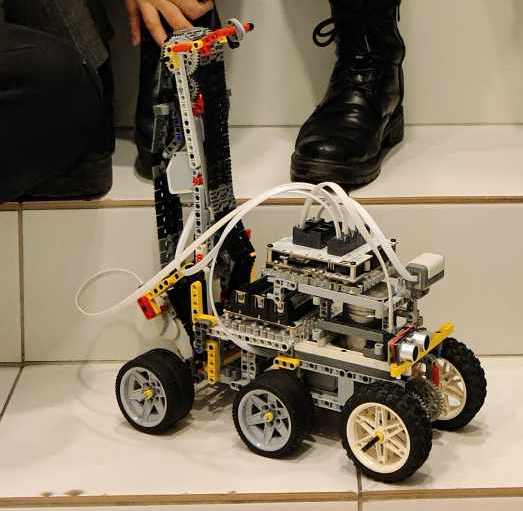

<<<<<<< HEAD
# Stair Climbing Robot README
    
## Overview
## Prerequisites
To run this code, you need the following:

- [Husarion CORE2 microcontroller](https://husarion.com/)
- [Husarion Robotics Framework](https://husarion.com/software/hframework/)

## Hardware Configuration
Ensure that the motors are connected to the correct ports on the CORE2 microcontroller. The code assumes the following motor configuration:

- `hMot1`: Motor for the front wheels
- `hMot2`: Motor for the rear wheels
- `hMot3`: Motor for the crawler track

The distance sensor and touch sensor should also be connected to the appropriate ports.

1. The robot consists of two main parts: 
    - The chassis - it has two wheels, one LEGO motor is attached to it along with a controller, batteries, and an additional load of 1 kg in the form of a steel rod.

2. The pivot point created using bolts attached to the crawler track and a fixed structure.
    

## Functionality
The robot is programmed to perform the following steps:

1. **Initialization:**
   - The system is started by pressing the touch sensor (`hBtn1`).
   - The number of stairs to climb is set by pressing the second touch sensor (`hBtn2`).

2. **Autonomous Climbing:**
   - The robot autonomously climbs stairs based on the detected distance using the front distance sensor (`frontLSens`).
   - The movement of the robot is controlled by adjusting power to the motors (`hMot1`, `hMot2`, `hMot3`) based on distance measurements.

3. **Stair Climbing Steps:**
   - The robot performs several stages, including approaching the stairs, aligning at the step, moving back to prevent tilting, engaging the crawler track, and climbing the stairs.

4. **LED Indication:**
   - After climbing the specified number of stairs, the LEDs (`hLED1`, `hLED2`, `hLED3`) flash to indicate the successful completion of the stair climbing task.

## Usage
1. Connect the hardware components as per the hardware configuration.
2. Flash the compiled code onto the Husarion CORE2 microcontroller.
3. Start the robot by pressing the touch sensor (`hBtn1`).
4. Set the number of stairs by pressing the second touch sensor (`hBtn2`).
5. The robot will autonomously climb the stairs based on the programmed logic.

## Notes
- Make sure to adjust motor power levels and sensor thresholds based on your specific robot and environmental conditions.

## Demonstration Video

Check out the robot in action! Click on the image above to watch the demonstration video.

## Authors
